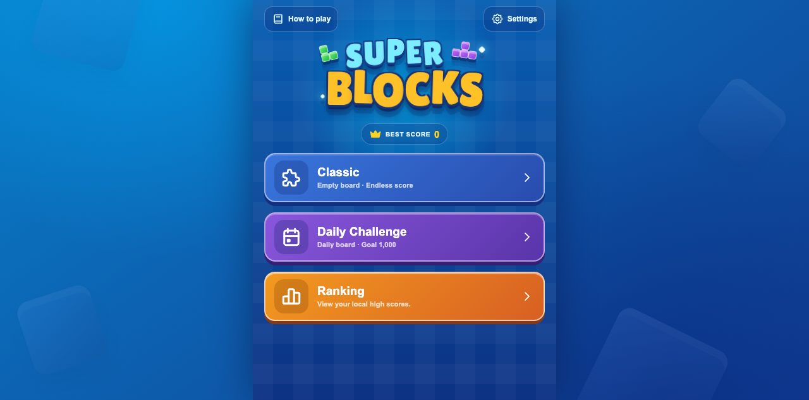

# Super Blocks

A lightweight, browser-based block puzzle game built with TanStack Start,
React, and Cloudflare Workers.



## Features

- Classic endless mode
- Deterministic daily challenge
- Mouse, touch, and keyboard-friendly controls
- English and Chinese interfaces
- Local best scores and score history
- Session restore after refresh
- Music, sound, haptics, hints, and reduced-motion preferences
- Responsive desktop and mobile layouts
- No account, database, object storage, payment, or email service required

## Tech stack

- TanStack Start
- TanStack Router
- React 19
- TypeScript
- Cloudflare Workers
- Playwright
- Biome

## Development

Requirements:

- Node.js 22+
- pnpm 10+

```bash
pnpm install
pnpm dev
```

The local application is available at `http://localhost:3000`.

## Quality checks

```bash
pnpm check
pnpm test
pnpm e2e
pnpm build
```

Install the Playwright browser when needed:

```bash
pnpm e2e:install
```

## Production build

Build and validate the Cloudflare Worker locally:

```bash
pnpm build
pnpm exec wrangler deploy --dry-run
```

## Deployment

The production Worker is configured for the custom domain
`blocks.mksaas.link`.

Authenticate Wrangler interactively:

```bash
pnpm exec wrangler login
```

Alternatively, provide deployment credentials to the local shell:

```bash
export CLOUDFLARE_ACCOUNT_ID="your-account-id"
export CLOUDFLARE_API_TOKEN="your-api-token"
```

Then deploy:

```bash
pnpm deploy
```

The Worker has no D1, R2, KV, Durable Object, or external API bindings.

`CLOUDFLARE_ACCOUNT_ID` and `CLOUDFLARE_API_TOKEN` are deployment credentials,
not Worker runtime variables. Do not upload them with
`wrangler secret put`; the running game does not need them.

This repository intentionally does not include GitHub Actions deployment.
Builds and deployments are run locally with pnpm and Wrangler.

## Routes

| Route | Purpose |
| --- | --- |
| `/` | Game menu |
| `/play/classic` | Classic game |
| `/play/daily` | Daily challenge |
| `/ranking` | Local scores |
| `/settings` | Language and game preferences |
| `/how-to-play` | Rules and scoring |

## Asset notice

Some audio files were extracted from publicly obtainable application assets
and are included only for learning and research. Their original source paths
are documented in [THIRD_PARTY_NOTICES.md](./THIRD_PARTY_NOTICES.md).

If you are a rights holder and believe an asset should be removed, please open
an issue or contact the repository maintainer. The asset will be reviewed and
removed when appropriate.

## License

Source code is released under the [MIT License](./LICENSE). Third-party assets
may be subject to separate rights described in
[THIRD_PARTY_NOTICES.md](./THIRD_PARTY_NOTICES.md).
